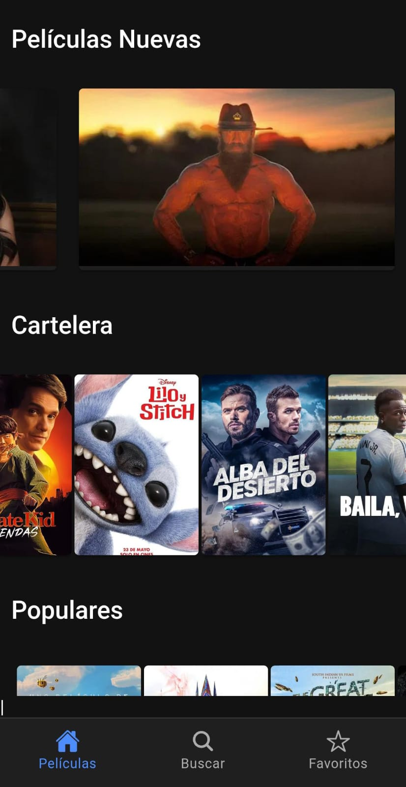
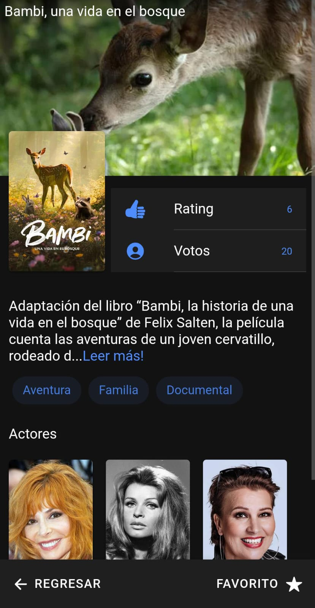
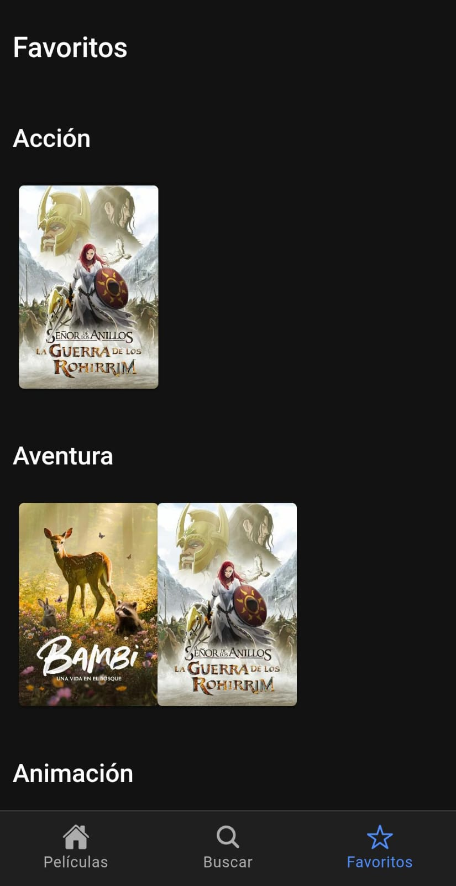
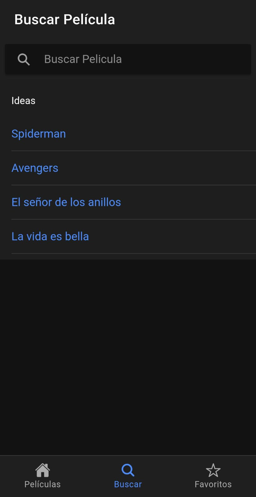

# Películas App

## Descripción General
Películas App es una aplicación móvil que funciona como una biblioteca de películas. Permite visualizar las películas más recientes y populares, realizar búsquedas y acceder a detalles al hacer clic en cada película. 
Además, los usuarios pueden agregar películas a sus favoritos, donde se mostrarán organizadas por género.

## Tecnologías y Dependencias Utilizadas
Este proyecto fue desarrollado utilizando las siguientes tecnologías:
- **Framework:** Ionic + Angular
- **Lenguajes:** TypeScript, HTML, SCSS
- **Base de datos & PWA:** Firebase
- **Dependencias:** Las principales dependencias están detalladas en el archivo `package.json`.
   Algunas dependencias destacadas:

  - `@ionic/angular`, `@ionic/storage`, `@ionic/storage-angular`
  - `@angular/*` (core, forms, router, service-worker)
  - `@capacitor/*` (app, haptics, keyboard, status-bar)
  - `cordova-sqlite-storage`
  - `swiper`, `rxjs`, `zone.js`

## Instalación y Ejecución Local
Sigue estos pasos para ejecutar la aplicación en tu entorno local:

1. Clona el repositorio:
   ```bash
   git clone https://github.com/luflur/peliculasApp.git ```
2. Accede al directorio del proyecto:
  ```bash
  cd peliculasApp ```
3. Instala las dependencias:
  ```bash
  npm install ```
4. Ejecuta la aplicación:
  ```bash
  ionic serve ```

También puedes acceder a la versión PWA de la aplicación en el siguiente enlace: https://peliculas-687ea.web.app/

## Capturas de Pantalla 
  
  

   

## Créditos 
Este proyecto fue desarrollado siguiendo el curso de Udemy:  
**"Google Play Store, Apple App Store, PWAs, Push Notifications, despliegues en la web, tabletas y mucho más"**  
Fernando Herrera - Full-Stack Developer & Teacher

